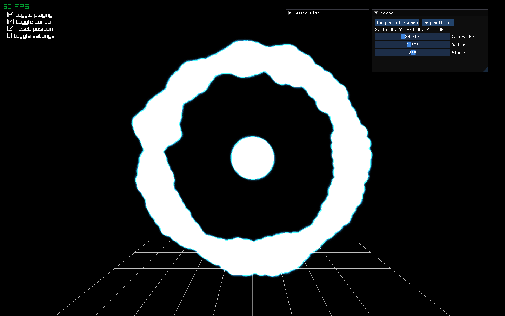

# Raylib Music Visualizer

A simple visualizer made in C++ and Raylib.



## Building

```
git clone git@github.com:Muffinaa/music-visualizer.git --recursive
cd music-visualizer
cmake -S . -B ./build -G Ninja
cmake --build build
```

## Usage

Put the music files in the "resources" folder

